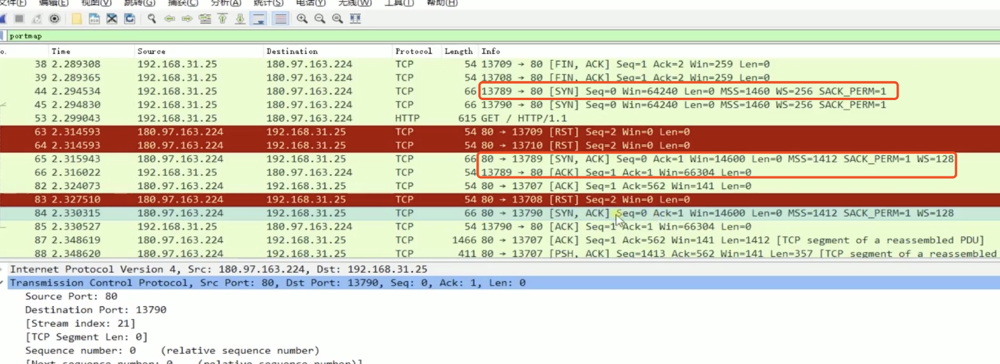

#### 5层网络模型

服务端和客户端都存在五层网络模型

- 物理层：定义物理设备如何传输数据，就是电脑的硬件，如网卡端口

- 数据链路层：在通信实体间建立数据链路的连接

- 网络层：为数据在节点间的传输创建逻辑链路，如我的电脑如何访问到百度服务器

- 传输层：向用户提供端到端的服务，主要有TCP/IP协议。在我的电脑和服务器建立连接后，用来定义数据传输的方式

- 应用层：为应用软件提供服务，有构建于TCP协议之上的HTTP协议

#### http协议发展历史

1. http0.9

- 只有一个请求方式get，没有header等描述数据信息

- 服务器发送完毕后，就关闭TCP连接

2. http1.0

- 增加了post等请求方式，增加了status code和header，status code用来描述服务端处理请求后的状态，header用来描述请求和响应的数据信息

3. http1.1

- 持久连接，在http1.0中，每发送一个http请求，就要在客户端和服务端之间创建一个TCP连接，服务端响应后就会关闭，创建这样的连接成本比较高，http1.1中避免了这样的问题

- pipeline，一个TCP连接可以发送多个http请求，服务端接收到这些请求后顺序接收，但是存在的问题是，如果前一个请求耗时较长会影响后一个请求的接收

- 增加header的一些描述信息，如host

4. http2

- 所有数据通过二进制进行传输，而http1.1中大多数以字符串的形式传输。所有的数据以帧的形式进行传输

- 同一个TCP连接发送多个请求不需要再顺序返回，并行处理

- header信息压缩，每次请求和响应都会携带header，压缩header可以提升传输效率

- 推送，服务端也可以主动推送数据给客户度

#### TCP连接过程

需要注意的是，http请求是建立在TCP连接之上的，TCP建立连接时要经历三次握手才能发送http请求

##### 三次握手

1. 首先客户端发起一个要创建TCP连接的请求，携带有标志位SYN=1和Seq=X，表明要创建TCP连接

2. 服务端接收到后表示同意连接，并响应SYN=1、ACK=X+1、Seq=Y

3. 客户端接收到响应后，知道服务端允许创建TCP连接，再次请求服务端确认连接，并携带ACK=Y+1、Seq=Z，服务端接收到后建立TCP连接

三次握手可以让客户端和服务端及时的察觉到可能因为网络原因客户度数据发送失败，服务端的端口可以及时关闭，避免造成额外的开销

抓包工具所展示的一次TCP连接的过程如下，其中13789是客户端端口，80是服务端端口

##### 四次挥手

1. 首先客户端发起一个要关闭TCP连接的请求，携带有标志位FIN=1，序列号Seq=u（等于前面已经传送过来的数据的最后一个字节的序号加1），并停止发送数据

2. 服务端收到后表示确认，发送携带标志位ACK=1，ack=u+1，序列号Seq=v的数据。此时处于半关闭状态，即客户端已经没有数据要发送了，但是服务器若发送数据，客户端依然要接收

3. 服务器将最后的数据发送完毕后，服务端关闭客户端的连接，发送携带标志为FIN=1，ack=u+1，序列号Seq=w的数据，然后等待客户端确认

4. 客户端表示确认，发送标识位ACK=1，Seq=u+1，ack=w+1的数据，完成关闭

#### URI

URI：统一资源标志符，包括URL和URN，用来唯一标识互联网中的信息资源

URL；统一资源定位器，用来定位到某一个物理服务器中某个端口下的资源

URN：永久统一资源定位符，资源移动后还能被找到

#### http报文

##### 请求报文格式

- 起始行，即图中的GET /test/hi-there.txt HTTP/1.0，包括请求方式、资源的url、http协议版本

- 请求头

##### 响应报文格式

- 起始行，即图中的HTTP/1.0 200 OK，包括http协议版本、状态码、状态码具体含义

- 响应头

- 主体部分，与响应头以一个空行间隔