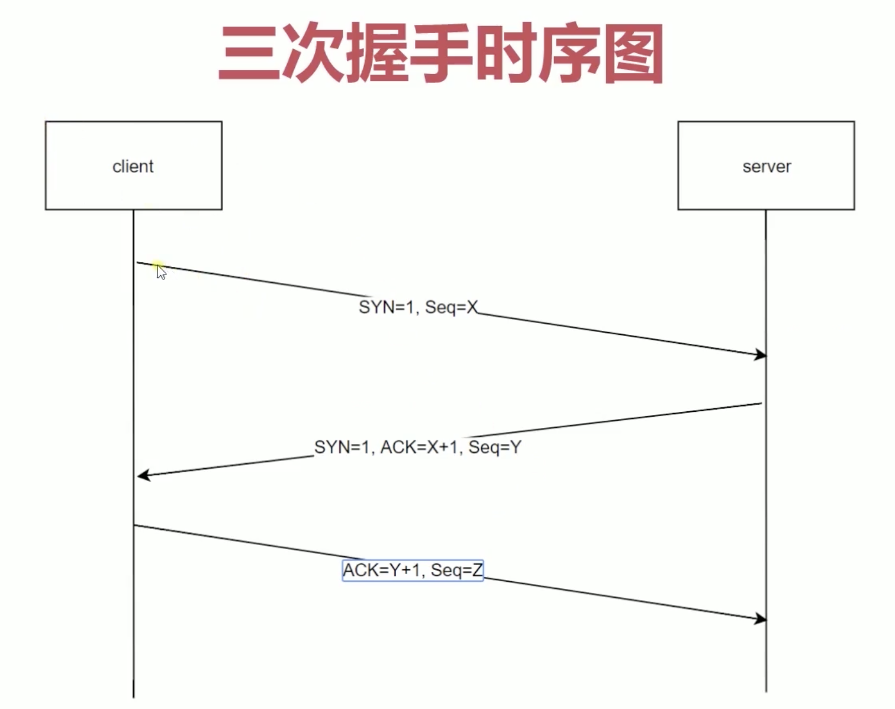

TCP/IP协议是一类协议的总称，包括TCP，UDP，IP，FTP，HTTP，ICMP，SMTP 等，作用于传输层，本质上是制定了某种规则来封装报文，其中最具代表性的就是TCP和UDP

#### UDP

全称是用户数据协议，与TCP协议一样用于处理数据包，有以下特点

- 面向无连接

不需要握手操作就可以发送数据，不会对数据报文进行任何拆分和拼接操作。

    - 在发送端，应用层将数据传递给传输层的 UDP 协议，UDP 只会给数据增加一个 UDP 头标识下是 UDP 协议，然后就传递给网络层了

    - 在接收端，网络层将数据传递给传输层，UDP 只去除 IP 报文头就传递给应用层，不会任何拼接操作

- 有单播，多播，广播的功能

UDP 不止支持一对一的传输方式，同样支持一对多，多对多，多对一的方式

- 不可靠性

没有拥塞控制，一直会以恒定的速度发送数据，在网络条件不好的情况下可能会导致丢包，也无法得知对方是否成功接收到数据了

- 头部开销小，传输报文效率高

UDP 头部包含了以下几个数据：两个十六位的端口号，分别为源端口（可选字段）和目标端口；整个数据报文的长度；整个数据报文的检验和（IPv4 可选 字段），该字段用于发现头部信息和数据中的错误

它只有8字节，比TCP的至少二十字节要少得多

#### TCP

全称是传输控制协议，有以下特点

- 面向连接

发送数据之前必须在两端建立连接。建立连接的方法是“三次握手”，保证了可靠性

- 仅支持单播传输

只能进行点对点的数据传输，不支持多播和广播传输方式

- 面向字节流

TCP不像UDP一样那样一个个报文独立地传输，而是在不保留报文边界的情况下以字节流方式进行传输

- 可靠性

TCP为了保证报文传输的可靠，就给每个包一个序号，同时序号也保证了传送到接收端实体的包的按序接收。然后接收端实体对已成功收到的字节发回一个相应的确认(ACK)；如果发送端实体在合理的往返时延(RTT)内未收到确认，那么对应的数据将会被重传

- 提供拥塞控制

当网络出现拥塞的时候，TCP能够减小向网络注入数据的速率和数量，缓解拥塞

- 提供全双工通信

允许通信双方的应用程序在任何时候都能发送数据，因为TCP连接的两端都设有缓存，用来临时存放双向通信的数据

##### 三次握手

1. 首先客户端发起一个要创建TCP连接的请求，携带有标志位SYN=1和Seq=X，表明要创建TCP连接

2. 服务端接收到后表示同意连接，并响应SYN=1、ACK=X+1、Seq=Y

3. 客户端接收到响应后，知道服务端允许创建TCP连接，再次请求服务端确认连接，并携带ACK=Y+1、Seq=Z，服务端接收到后建立TCP连接

三次握手可以让客户端和服务端及时的察觉到可能因为网络原因客户度数据发送失败，服务端的端口可以及时关闭，避免造成额外的开销

抓包工具所展示的一次TCP连接的过程如下，其中13789是客户端端口，80是服务端端口

##### 四次挥手

1. 首先客户端发起一个要关闭TCP连接的请求，携带有标志位FIN=1，序列号Seq=u（等于前面已经传送过来的数据的最后一个字节的序号加1），并停止发送数据

2. 服务端收到后表示确认，发送携带标志位ACK=1，ack=u+1，序列号Seq=v的数据。此时处于半关闭状态，即客户端已经没有数据要发送了，但是服务器若发送数据，客户端依然要接收

3. 服务器将最后的数据发送完毕后，服务端关闭客户端的连接，发送携带标志为FIN=1，ack=u+1，序列号Seq=w的数据，然后等待客户端确认

4. 客户端表示确认，发送标识位ACK=1，Seq=u+1，ack=w+1的数据，完成关闭

#### 总结

 指标 | UDP | TCP
---|---|---
是否连接 | 无连接 | 面向连接
是否可靠 | 不可靠，无需握手，无拥塞控制 | 可靠，需握手，有拥塞控制
连接对象个数 | 	支持一对一，一对多，多对一和多对多 | 一对一
传输方式 | 面向报文 | 面向字节流
首部开销 | 开销小，仅8字节 | 20-60字节
适用场景 | 适用于实时应用，如IP电话、视频会议、直播 | 适用于要求可靠传输的应用，如文件传输